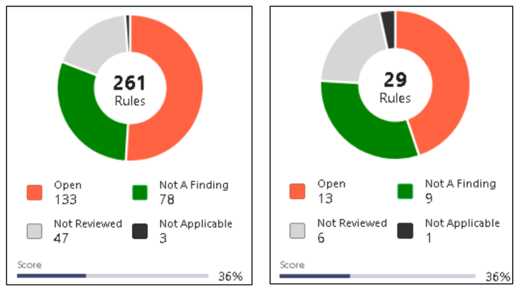
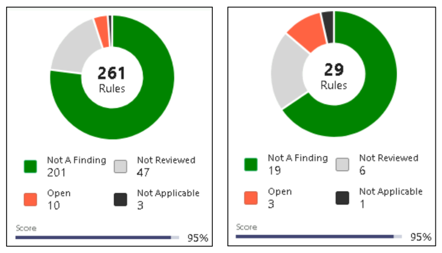
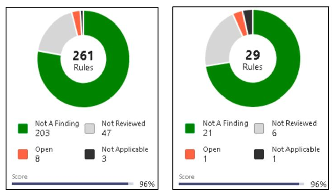

# 🔐 DISA STIG Hardening Project

## Overview
This project demonstrates the use of **DISA Security Technical Implementation Guides (STIGs)** to harden a Windows 10 system. It was completed as part of a cybersecurity course focused on identifying and mitigating system vulnerabilities using automated compliance tools and manual configuration techniques.

---

## 🎯 Objective
To install and use DISA STIG tools on a Windows 10 virtual machine image, identify CAT I vulnerabilities, apply recommended configurations using Group Policy Objects (GPOs), and verify system hardening through multiple scans.

---

## 🛠️ Tools Used
- **SCAP Compliance Checker (SCC)** – To scan and identify security misconfigurations based on DISA STIGs.
- **STIG Viewer** – To interpret and track compliance status using XCCDF results.
- **Microsoft Local Group Policy Object Utility (lgpo.exe)** – To apply GPOs provided by DISA.
- **Windows 10 Virtual Machine** – Custom image provided in CYB 290 course materials.

---

## 🧠 Skills Gained
- Interpreting DISA STIG scan results.
- Using government-provided tools to automate system hardening.
- Applying group policy configurations via `lgpo.exe`.
- Remediating vulnerabilities manually when needed.
- Identifying misconfigurations that may be missed by automated tools.
- Understanding CAT I vulnerabilities and their impact.

---

## 📄 Full Report

Click to expand report

### Q1. Most Critical CAT I Vulnerability
The most critical CAT I vulnerability identified was **V-220702**, which requires BitLocker encryption on all disks. Without BitLocker, if a device is lost or stolen, sensitive data can be accessed by unauthorized users. BitLocker adds a vital layer of protection by encrypting data and ensuring it can only be decrypted with the correct credentials or keys. This vulnerability is high priority due to the direct risk of data leakage.

---

### Q2. STIG Viewer Pie Chart – First Scan  

---

### Q3. STIG Viewer Pie Chart – After Applying GPOs  

---

### Q4. Remaining CAT I Vulnerabilities After GPO Application
After applying the DISA-provided Group Policy objects via `lgpo.exe`, the following vulnerabilities remained:

- **V-220702** – BitLocker is still not enabled.
- **V-220718** – Internet Information Services (IIS) is still installed, which increases the system's attack surface.
- **V-220726** – Data Execution Prevention (DEP) is not configured to "OptOut", which is required to prevent malicious code from executing in memory.

These vulnerabilities were not addressed by GPOs and had to be fixed manually.

---

### Q5. STIG Viewer Pie Chart – Final Scan After Manual Fixes  

---

### Q6. Observations from Manual Review
A manual inspection of the system revealed additional risks not detected by DISA tools:
- Windows was **not fully updated**, exposing it to known vulnerabilities.
- Multiple unexpected users (e.g., **Visitor** in the admin group) were found with administrative rights.
- **Telnet** was installed, which transmits data in plaintext and is considered insecure.

This emphasized the importance of complementing automated scanning with hands-on analysis for a more complete security assessment.

